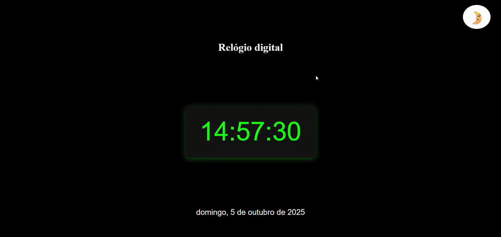

# Relógio Digital 🕒

## Descrição
Criei este pequeno e simples projeto com o objetivo de praticar JavaScript. Ele representa um relógio digital que mostra as horas em tempo real. O relógio também possui um botão de alternância de tema claro e escuro e exibe a data atual logo abaixo das horas.

## Dificuldades
No início, senti dificuldade para exibir as horas corretamente, mas depois de estudar e testar um pouco mais, consegui resolver. Nada que uma boa prática não dê conta!

## Funcionalidades
- Desenvolvido com HTML, CSS e JavaScript
- Alternância entre tema claro e escuro
- Exibição das horas em tempo real
- Exibição da data atual abaixo do relógio

## Projeto online
Acesse [aqui.](https://relogio-digital-murex.vercel.app/)

## Tecnologias

 
 
 

 

## Visualização

## Autora
- Luciane Kellen
- Feito como parte do meu processo de aprendizagem em programação!

  
  
  

